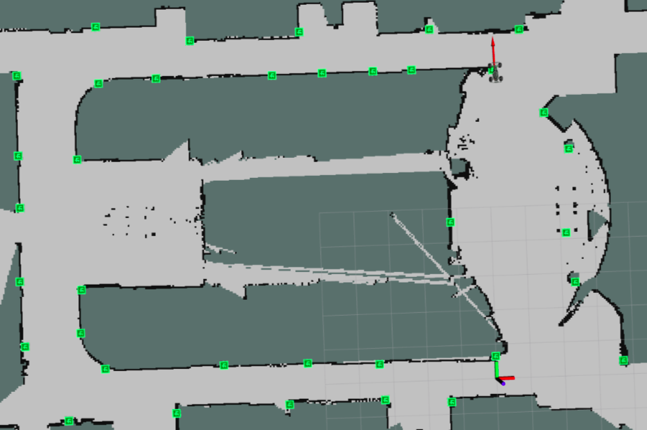
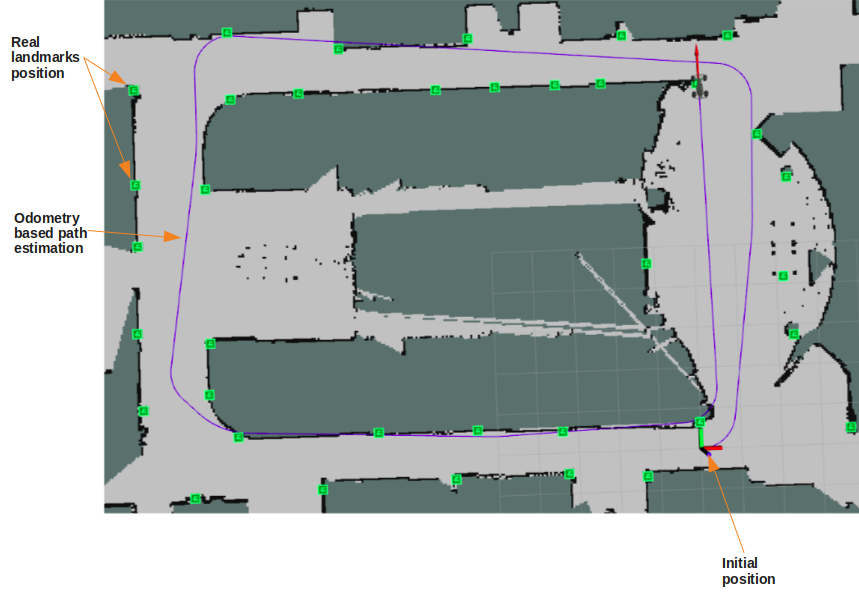
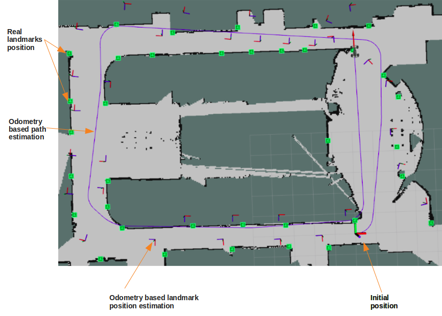
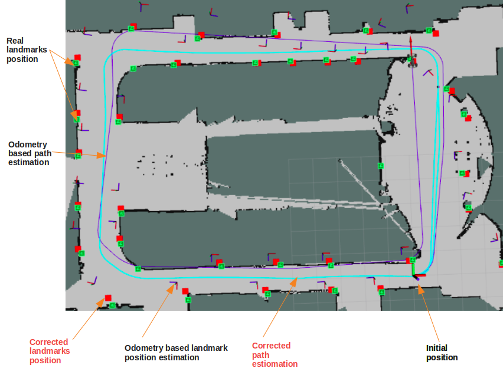

# SLAM: ROS environement packages
## Description:
During my intern, the goal was to prepare an environement for the back-end of a SLAM (Simultanious Localization And Mapping) algorithm. Based on a fusion of sensors data (rover speed-steering and camera-based estimation of landmarks position), the back-end estimates the localization of the robot and the position of the scene landmarks (mapping). The front end goal is to provide synchronised and adapted sensors data to the back-end. 

For validation and testing purposes, a complete suit is devolopped to visualize the results of the SLAM algorithm and compare them to an odometry based localization and mapping.

The used back-end algorithm is EKF-SLAM. GraphSLAM was also tested.

## Results:
The following image represents a map of the test building. The map is acquired using an out-of-the-box SLAM algorithm (gmapping) and a LIDAR. The green squares represents the real position of the landmarks.

The next image illustrate the result of odometry-based path estimation. Odometry consists of the rover's wheels speed, steering and the rover's (x,y) coordinates in the frame associated to initial position:

As one can remark, the rover's path goes through the building walls. Odomotry accumulates error and path estimation finishes by deviating from the real path. The position of landmarks (April tag detectable by camera) placed in the buildings is also estimated:

Instead of using the real landmarks position to correct the path estimation (simpler filtering problem), this information is considered unknown and estimated using mono-camera and the current odometry pose estimation. The odometry path and landmarks positions estimations serves for a sensor fusion to correct both the path and the landmarks position:

For further details, please refer to the intern presentation's slides:
https://docs.google.com/presentation/d/1Lh5SFXUTre3Tx0ith_qOZM8cdH3SMtDPEAFWdO35tQM/edit?usp=sharing
